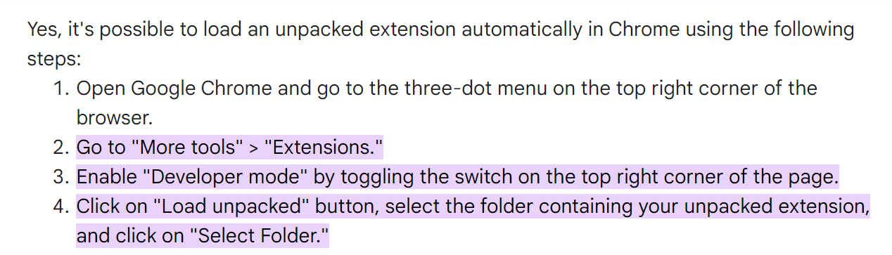
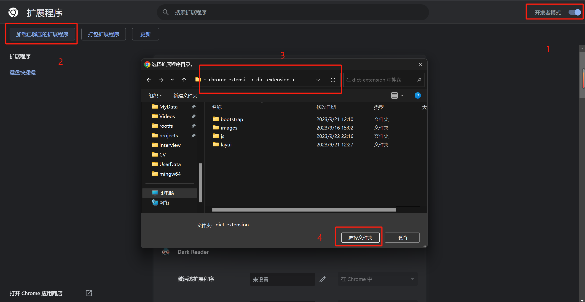
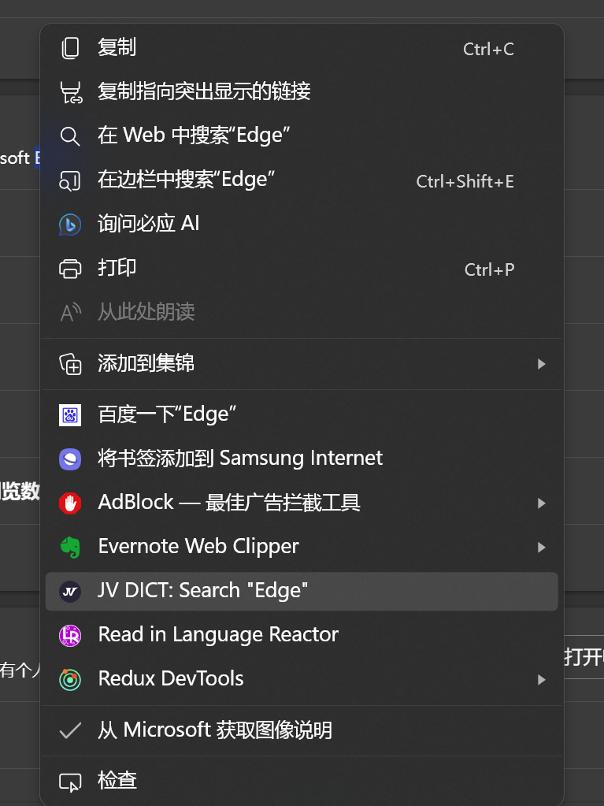
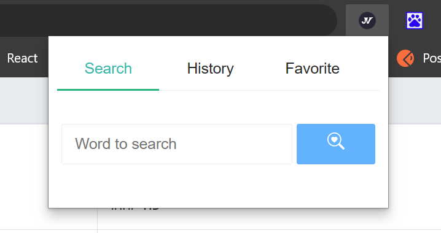
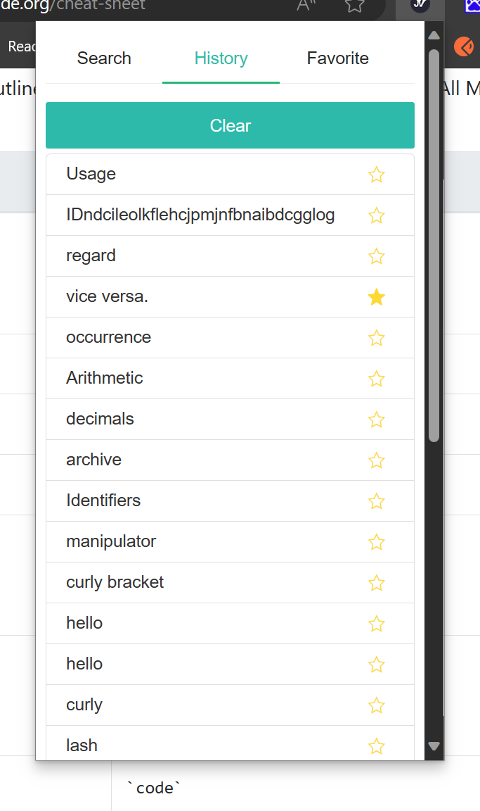
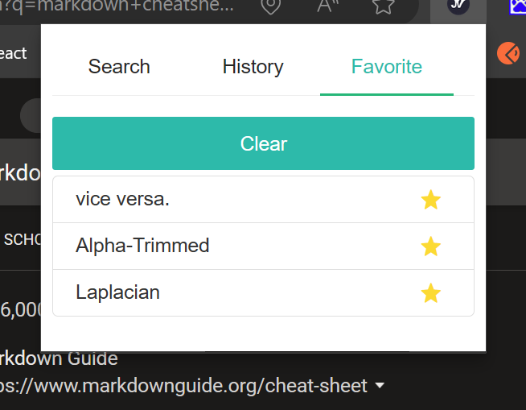

# chrome-extensions
# JV DICT

# Introduction
An extension that helps you search words or sentences in a very convenient way.

# How to install this extension?

>**1. git clone the repository or download the zip file and unzip it.**
> 
>**2. follow the steps in the above picture, and select the path of the unzip file which is "{base path}\chrome-extensions\dict-extension".**

# Usage of JV DICT extension

## menu

>**1. Select words or sentences.**
> 
>**2. Right-click your mouse.**
> 
>**3. Select "JV DICT: Search ".**

## Search

>**1. Open the "JV DICT" extension panel which is on the upper-right of your chrome.**
> 
>**1. Enter words or sentences**
> 
>**2. Press the search button or tap the "Enter" key.**

---

## History

>**1. Show your search history.**
> 
>**2. Click a history to show the result.**
> 
>**3. Click the star icon to favorite.**
> 
>**4. Click "Clear" to clear history.**
---

## Favorite

>**1. Show your favorites.**
> 
>**2. Click the star icon to remove the record.**
> 
>**3. Click a favorite to show the result.**
> 
>**4. Click "Clear" to clear your favorites. A confirmation is required.**
